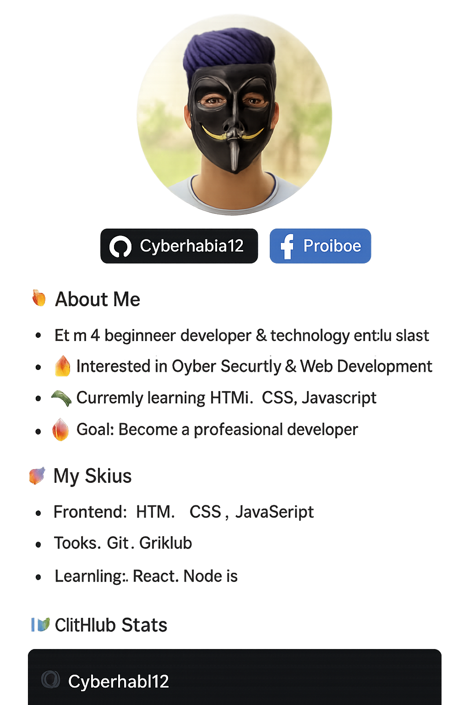

<h1 align="center">👋 Hi, I'm MD HABIB TORAFDER</h1>

  

  
  

---

## 🔥 About Me
- 💻 I’m a beginner developer & technology enthusiast  
- 🔥 Interested in Cyber Security & Web Development  
- 🌱 Currently learning HTML, CSS, JavaScript  
- 🎯 Goal: Become a professional developer  

---

## 🚀 My Skills
- **Frontend:** HTML, CSS, JavaScript  
- **Tools:** Git, GitHub  
- **Learning:** React, Node.js  

---

## 📊 GitHub Stats

  

  

---

## 🔗 Connect With Me
- **Facebook:** [MD HABIB TORAFDER](https://www.facebook.com/profile.php?id=61580301505646)  
- **GitHub:** [Cyberhabib12](https://github.com/Cyberhabib12)

---

🔥 Thanks for visiting my profile 🔥

